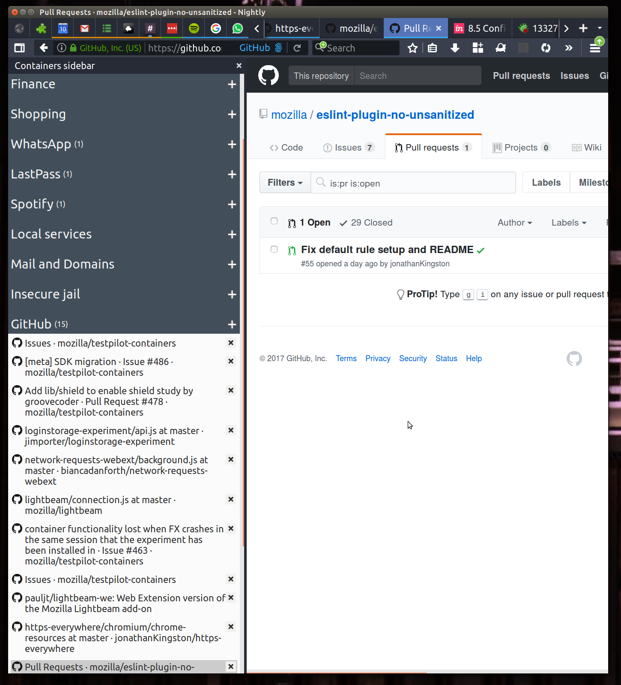

# Containers sidebar

## What it does

Opens a sidebar to manage containers

# Installing

- Go to about:debugging
- Load Temporary Addon
- Click the manifest file in this directory

# What it shows

Demonstration of various tabs API functions.
